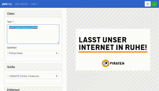

***ppic**:ng* is a tool to make the creation of share pics easier for organizations.

With ppic:ng you can create a custom design template for sharepics, which your collegues/members/... can customize via a browser (and thanks to PWA: mobile) app with an easy-to-use interface.



This tool was initially created for [the German Pirate Party](https://piratenpartei.de). This repository does not contain designs and logos of the Pirate Party, example logos and designs are included instead. If you want to use this tool for your own organization, you have to create your own designs. I will add a tutorial to do this later (probably), until then, you can have a look into `src/designs/example` and start from there.

   

# Features
* Works with **multiple custom design templates**
* **Automatically fit the font size** to the available space
* Use **images** as background or side-by-side
* Supports the selection of a logo from a list
* The app runs completely in the browser, no download necessary
* The **Progressive Web App** (PWA) is **mobile friendly** and works **completely offline**

# Getting started
1. Clone this repository
2. Create an `.env` file by renaming `example.env` and edit it (see below)
3. Run `npm install` in the main directory
4. Run `npm start` to start the development server
5. Visit http://localhost:3000
6. 
# Customization

## Designs
If you have some prepared designs ready, copy them to `src/designs`. They will be recognized automatically.

## Logos
If your design supports logos, you can add your logos to `src/logos`. Using the `png` format with transparency is recommended.

There is no forced way how to store the image files in `src/logos`. However, you have to provide a file `src/logos/logos.json` with information about the logos.

### logos.json
The logo index file in a minmal version looks like this:
```json
{
  "group1": {
    "title": "Allgemein",
    "logos": {
      "logo1": {
        "title": "Logo 1",
        "default": "./group1/logo1.png"
      },
      "logo2": {
        "title": "Logo 2",
        "default": "./common/logo2.png"
      }
    }
  }
}
```
This example defines a logo group `group1` with the name `Allgemein`. The group contains two logos, `logo1` and `logo2`.
You can define multiple custom groups with multiple logos in each of them.

#### Variants

You can also define dark and light variants for each logo. If the design supports it, the dark or the light variant will be chosen by the background behind the logo.
```json
{
  "group1": {
    "title": "Allgemein",
    "logos": {
      "logo1": {
        "title": "Logo 1",
        "default": "./group1/logo1.png",
        "variants": {
          "dark": "./regional/logo1_dark.png",
          "light": "./regional/logo1_light.png"
        }
      }
    }
  }
}
```
If no variants are given for a logo, the default image is used.

#### Exclude from designs

If you want to exclude some *logo groups* from specific designs, you can specify the key `excludeFromDesigns`:
```json
{
  "group1": {
    "title": "Allgemein",
    "excludeFromDesigns": ["classic-eu", "gp2024"],
    "logos": {
      "logo1": {
        "title": "Logo 1",
        "default": "./group1/logo1.png"
      }
    }
  }
}
```
## Configuration
You can change some options via environment variables. The recommended way is to use a file `.env`. If you want to overwrite some variables for your local development server, you can user `.env.local`. See [the React documentation](https://create-react-app.dev/docs/adding-custom-environment-variables/) for more information.

* `REACT_APP_DESIGN_DEFAULT=classic`: The name of the default design. Has to be exacly the same as the folder in `src/designs`.
* `REACT_APP_DESIGN_xyz_DISABLE=true`: Disables a specific design. Replace `xyz` with the design name.
* `REACT_APP_DESIGN_xyz_PASSWORD=passwordhash`: Enables password protection for a specific design. Replace `xyz` with the design name and `passwordhash` with the sha512-hash of the password. **Note:** This is not secure at all! If you really want to make sure, that nobody can use this tool for a design, you should restrict the access to the tool itself!
* `REACT_APP_MATOMO_ENABLE=true`: Enables statistic collection with matomo.
* `REACT_APP_MATOMO_URL=mymatomoserver.com`: The matomo server.
* `REACT_APP_MATOMO_SITEID=1`: The matomo site id.
* `REACT_APP_INFO=text`: Text that is shown after a click on the Info button. Supports HTML.

# Deploy
1. Change designs and logos (see below)
2. Run `npm run build`
3. Copy the contents of the `build` folder to your server

# Contribute
tbd

# License
tbd

# Acknowledgement
tbd
